# Playwright Fixtures: Technical Analysis

## 📚 Table of Contents
1. [Introduction](#introduction)
2. [How Fixtures Work](#how-fixtures-work)
3. [Execution Flow](#execution-flow)
4. [Project Architecture](#project-architecture)
5. [Advantages](#advantages)
6. [Disadvantages](#disadvantages)
7. [When to Use](#when-to-use)
8. [References](#references)

---

## Introduction

**Fixtures** are a Playwright mechanism that allows you to:
- Share setup between tests
- Automatically inject dependencies
- Manage resource lifecycle (setup/teardown)
- Reuse common code

In this repository, fixtures are used to centralize access to **Page Objects** through the `PageManager`, abstracting initialization complexity and keeping tests clean and readable.

---

## How Fixtures Work

### Core Concept

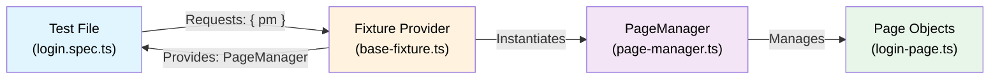

### Layered Structure

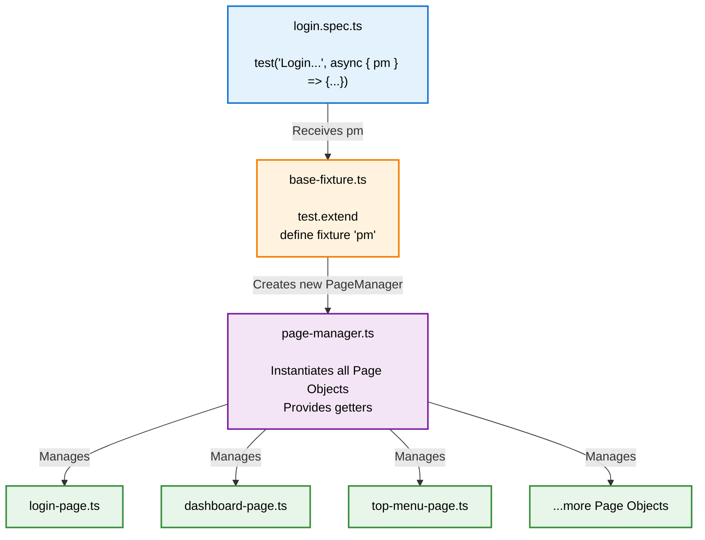

---

## Execution Flow

### Initialization Sequence

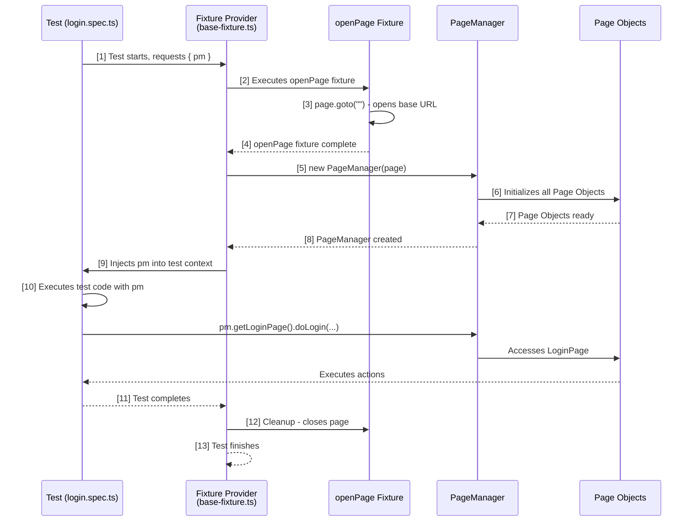

### Complete Lifecycle

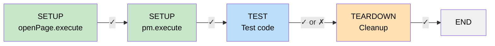

---

## Project Architecture

### General Structure

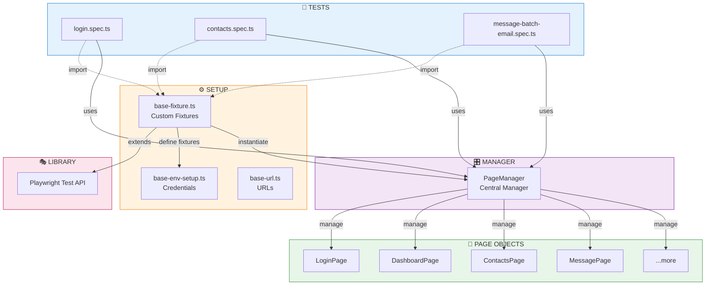

---

## Comparison: With vs Without Fixtures

### WITHOUT Fixtures (❌ Duplication)

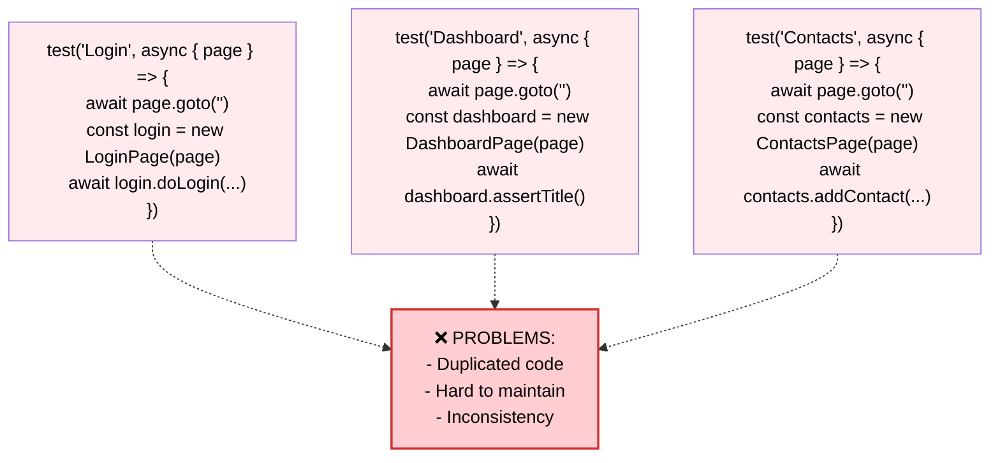

### WITH Fixtures (✅ Centralized)

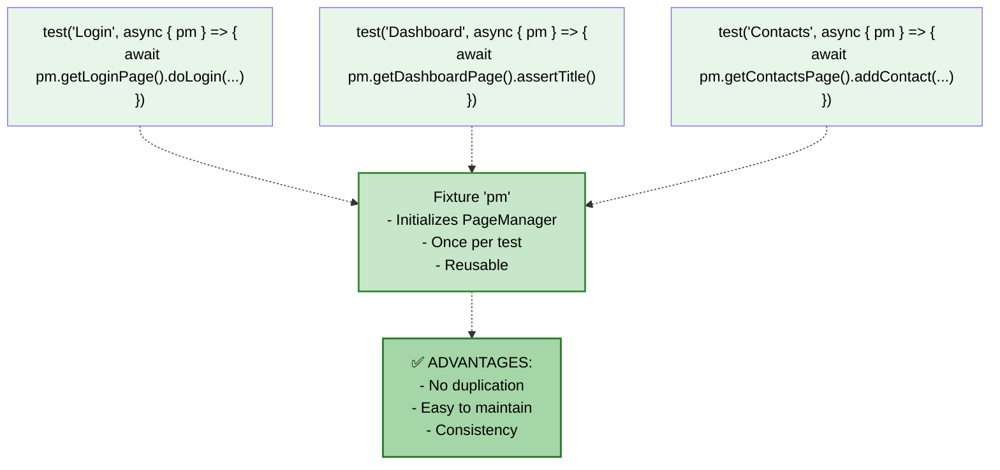

---

## Code: Step-by-Step Implementation

### 1️⃣ Base-Fixture: Defining Fixtures

```typescript
// tests/setup/base-fixture.ts
import { test as base } from "@playwright/test";
import { PageManager } from "@pages/page-manager";

// Typing: what each fixture provides
export type TestOptions = {
  openPage: string;
  pm: PageManager;
};

export const test = base.extend<TestOptions>({
  // Fixture 1: openPage (page setup)
  openPage: async ({ page }, use) => {
    const URL = await page.goto("");  // Opens the base URL
    console.log("========= Opening ", URL?.url());
    await use("");  // Injects into the next fixture
  },

  // Fixture 2: pm (depends on openPage)
  pm: async ({ page, openPage }, use) => {
    // ↑ Receives page and openPage automatically
    const pageManager = new PageManager(page);
    await use(pageManager);  // Injects into the test
    // Automatic cleanup after the test
  },
});

export { expect } from "@playwright/test";
```

### 2️⃣ PageManager: Centralizing Page Objects

```typescript
// tests/ui/pages/page-manager.ts
import { type Page } from "@playwright/test";
import { LoginPage } from "@pages/general/login-page";
import { DashboardPage } from "@pages/general/dashboard-page";
// ... more imports

export class PageManager {
  readonly page: Page;
  private readonly loginPage: LoginPage;
  private readonly dashboardPage: DashboardPage;
  // ... more Page Objects

  constructor(page: Page) {
    this.page = page;
    this.loginPage = new LoginPage(this.page);
    this.dashboardPage = new DashboardPage(this.page);
    // ... initializes more Page Objects
  }

  getLoginPage() {
    return this.loginPage;
  }

  getDashboardPage() {
    return this.dashboardPage;
  }
  // ... more getters
}
```

### 3️⃣ Test: Using the Fixture

```typescript
// tests/ui/specs/login.spec.ts
import { test } from "@setup/base-fixture";  // Our custom fixture!
import userData from "@data/user-data";

test.describe("Login suite", { tag: ["@login"] }, () => {
  test("Login with valid credentials", async ({ pm }) => {
    // ↑ pm is automatically injected by the fixture!
    
    await test.step("Login and validate", async () => {
      await pm.getLoginPage().doLogin(username, password);
      await pm.getDashboardPage().assertDashboardTitleIsPresent();
    });
  });
});
```

---

## Advantages

| # | Advantage | Description | Benefit |
|---|----------|-----------|----------|
| 1 | **Reusability** | `openPage` and `pm` are created once and shared | Less duplicated code |
| 2 | **Dependency Injection** | Fixtures resolve dependencies automatically | Cleaner code |
| 3 | **Isolation** | Each test receives a clean instance of `pm` | Independent tests |
| 4 | **Centralization** | A single point (`PageManager`) to access Page Objects | Easy to maintain |
| 5 | **Abstraction** | Tests don't deal with `page` directly | Focus on the scenario |
| 6 | **Maintenance** | Changes in Page Objects don't affect tests | Less refactoring |
| 7 | **Lifecycle** | Automatic Setup/Teardown managed by Playwright | Less boilerplate code |
| 8 | **Type Safety** | TypeScript ensures `pm` has correct methods | Fewer errors |

### Practical Example: Centralization Advantage

```typescript
// ❌ WITHOUT CENTRALIZATION - Multiple tests, multiple initializations
test("test1", async ({ page }) => {
  await page.goto("");
  const loginPage = new LoginPage(page);
  const dashboard = new DashboardPage(page);
  await loginPage.doLogin(...);
});

test("test2", async ({ page }) => {
  await page.goto("");  // ❌ DUPLICATED
  const loginPage = new LoginPage(page);  // ❌ DUPLICATED
  const contacts = new ContactsPage(page);
  await contacts.addContact(...);
});

// ✅ WITH FIXTURES - One setup, multiple tests
test("test1", async ({ pm }) => {
  await pm.getLoginPage().doLogin(...);  // ✅ Simple!
  await pm.getDashboardPage().assertTitle();
});

test("test2", async ({ pm }) => {
  await pm.getContactsPage().addContact(...);  // ✅ Simple!
});
```

---

## Disadvantages

| # | Disadvantage | Description | Impact |
|---|-------------|-----------|--------|
| 1 | **Learning Curve** | Developers need to understand fixtures and dependencies | Longer onboarding |
| 2 | **Overhead** | PageManager creation for every test (even simple ones) | Slightly reduced performance |
| 3 | **Less Control** | Customizing setup for specific tests is complex | Less flexibility |
| 4 | **Difficult Debugging** | Tracing flow between multiple fixtures is confusing | Slower debugging |
| 5 | **Full Initialization** | If a test needs 1 Page Object, all 8+ are created | Resource waste |
| 6 | **Deep Chaining** | Fixtures that depend on other fixtures | Increased complexity |
| 7 | **Rigidity** | Hard to override fixtures in specific tests | Less flexibility |
| 8 | **Encapsulation** | Can hide important details of what's happening | Less transparency |

### Example: Initialization Overhead

```typescript
// ❌ Simple test that initializes EVERYTHING
test("only needs LoginPage", async ({ pm }) => {
  // pm.constructor() initializes:
  // - LoginPage ✓ (used)
  // - DashboardPage ✗ (not used)
  // - ContactsPage ✗ (not used)
  // - DataJobsPage ✗ (not used)
  // - MessagePage ✗ (not used)
  // - DiagramPage ✗ (not used)
  // - KitchenSinkStepsPage ✗ (not used)
  // - AudiencePage ✗ (not used)
  
  await pm.getLoginPage().doLogin(...);
});

// ✅ Alternative: without fixture for simple cases
test("only needs LoginPage (no fixture)", async ({ page }) => {
  await page.goto("");
  const loginPage = new LoginPage(page);
  await loginPage.doLogin(...);
});
```

---

## When to Use

### ✅ Use Fixtures When:

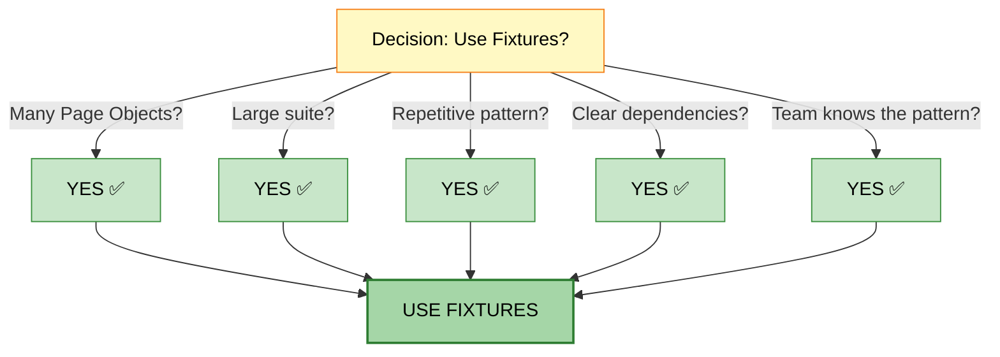

### ❌ Avoid Fixtures When:

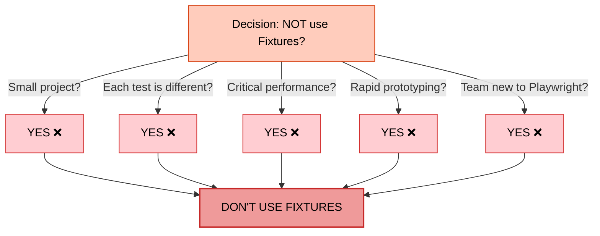

---

## Decision Matrix

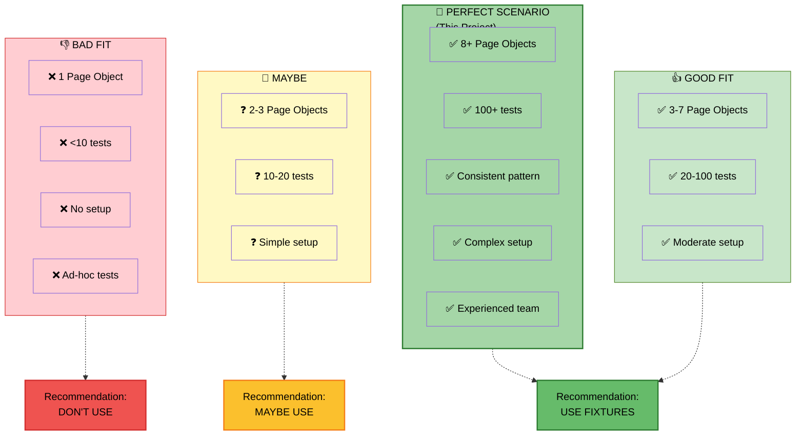

---

## Technical Summary

### Dependency Injection in Action

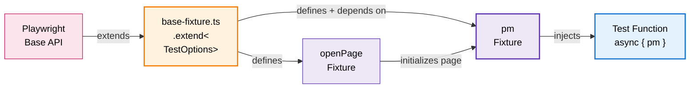

### Execution Order

| # | Step | Code | Status |
|---|-------|--------|--------|
| 1 | Playwright starts | `test.extend<TestOptions>()` | ⏳ Setup |
| 2 | openPage fixture | `page.goto("")` | ⏳ Setup |
| 3 | pm fixture | `new PageManager(page)` | ⏳ Setup |
| 4 | Test executes | `await pm.getLoginPage()...` | ⏱️ Execution |
| 5 | Cleanup | Resource closing | ⏸️ Teardown |

---

## Comparison with Other Approaches

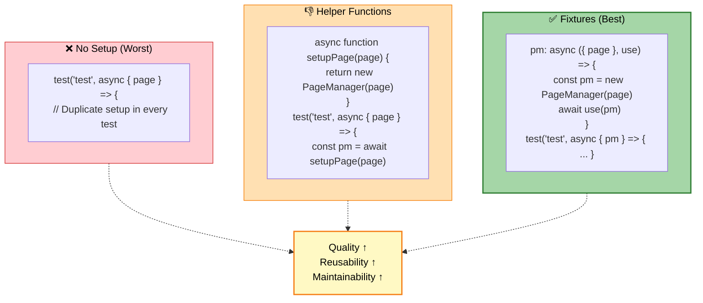

---

## Conclusion

### 📊 Final Analysis

This project implements **fixtures as a Design Pattern** with:

✅ **Positive Points:**
- Centralization via `PageManager`
- Complexity abstraction
- Consistency across tests
- Easy maintenance and extension
- Type-safe with TypeScript

⚠️ **Points of Attention:**
- Initial learning curve
- Full initialization overhead
- Less flexibility for specific customizations

### 🎯 Recommendation

**This project makes APPROPRIATE USE of fixtures because:**

1. Has **multiple Page Objects** (8+)
2. Has a **large volume of tests** (100+)
3. Follows a **consistent pattern**
4. Has **clear dependencies** (openPage → pm)
5. Prioritizes **maintainability and scalability**

### 🚀 Possible Improvements

```typescript
// Optional fixture for simple tests (lazy loading)
export const test = base.extend<TestOptions>({
  pm: async ({ page, openPage }, use) => {
    // Lazy initialization
    const pageManager = new PageManager(page);
    await use(pageManager);
  },
});

// Fixture for specific cases
test.extend<{ simpleLogin: LoginPage }>({
  simpleLogin: async ({ page }, use) => {
    await page.goto("");
    await use(new LoginPage(page));
  },
});
```

---

## References

- 📖 [Playwright Fixtures Documentation](https://playwright.dev/docs/test-fixtures)
- 🎯 [Playwright Best Practices](https://playwright.dev/docs/best-practices)
- 🏗️ [Page Object Model Pattern](https://playwright.dev/docs/pom)
- 📚 [Dependency Injection Pattern](https://en.wikipedia.org/wiki/Dependency_injection)

---

**Document generated on:** 2025-12-06  
**Project:** project2 - Playwright Test Suite  
**Version:** 1.0

